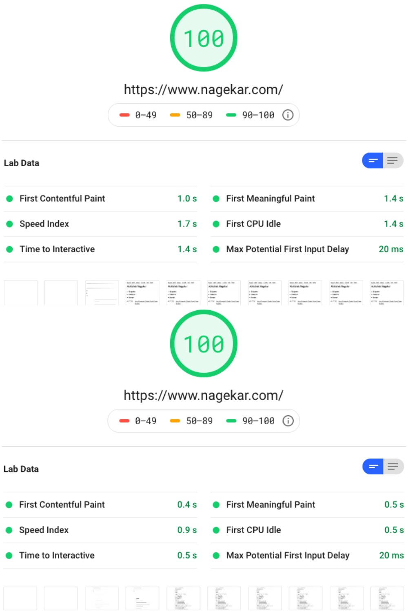
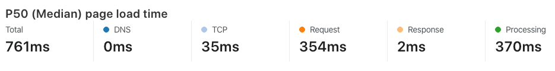
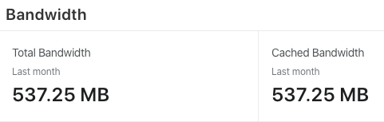
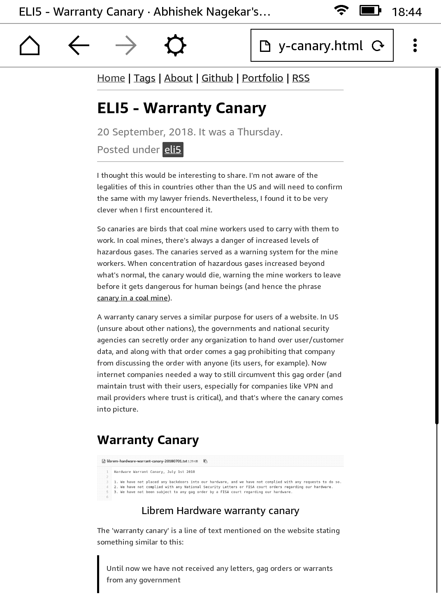

# Elementary
This is my personal blog's template that I've been optimizing for performance, accessibility, usability, readability and simplicity in general. 

I personally do not approve of personal blogs bloated with hundreds of kilobytes of trackers and analytics code. This theme could be best friends with plugins like [uBlock Origin](https://github.com/gorhill/uBlock).

#### Google Page Speed score

---
#### Median load time (From Cloudflare)

---

#### Caching statistics

### Accessibility
Theme doesn't mess up browser's default tab navigation. JavaScript is optional (Dark mode relies on JavaScript).

### Demo
<a href="https://elementary-jekyll.github.io/">https://elementary-jekyll.github.io/</a>

### Features
- Lightweight, <10KB CSS, <3KB (optional) JavaScript + 15KB Open Sans font file + your content
- Highly accessible with semantic HTML
- Structured data ([schema.org](https://schema.org)) pre-added for blog posts
- Dark mode (requires JavaScript for toggling class and saving user preference in cookies)
- Reading progress slider on top (requires JavaScript)
- JavaScript is optional (turn it off in `_config.yml`)
- No request made to any third party
- Any many more...

### Installation
- Add Elementary repository as a submodule to your Jekyll blog `git submodule add git@github.com:abhn/Elementary.git elementary`
- Add `theme: elementary` to your `_config.yml`
- Add `gem 'elementary', path: 'elementary'` to your `Gemfile`
- Run `bundle install` command in your project directory
- Add `./elementary` to `exclude` section of `_config.yml` so that the theme's files aren't compiled into the final site

### Customization
- You're free to make any edits to the theme's files in the submodule. You can also `git pull origin master` from the submodule directory to update the theme in case I push updates, but you don't have to.
- In `_config.yml`, you can add new collections (groups of new content, so blog posts, news, pictures could all be their own collections with separate listing on index page)

### Credits
- Eric S Raymond (http://www.catb.org/~esr/hacker-emblem/glider.png) for the favicon

### Inspiration

I recently read in a blog post that a personal blog has to be fast and lean. There's no reason for a personal blog to be bloated and take 2 seconds to load. That was when I reviewed my own blog code and started analyzing. I discovered that I was loading jQuery just for another jQuery plugin which just helped the images and videos to be mobile responsive. That was some 40KB of overhead, 2 additional requests which could have been prevented with just a `max-width: 100%` attribute to the culprit elements. Similarly, there was Disqus which loaded tonnes of scripts along with its own Google Analytics script. 

I went on stripping weight from the code, and was left with something what you see here. Few extra CSS tweaks and Tadaa!

### License
GNU GENERAL PUBLIC LICENSE Version 3

### Going v1.0
When I started with the [original project](https://github.com/abhn/Elementary/releases/tag/v0.1) around 2 years ago, my goal was to get rid of all that unnecessary code and progressively add only the most essential bits. 

I feel like the theme is in good enough shape right now that I can call it a v1.0
